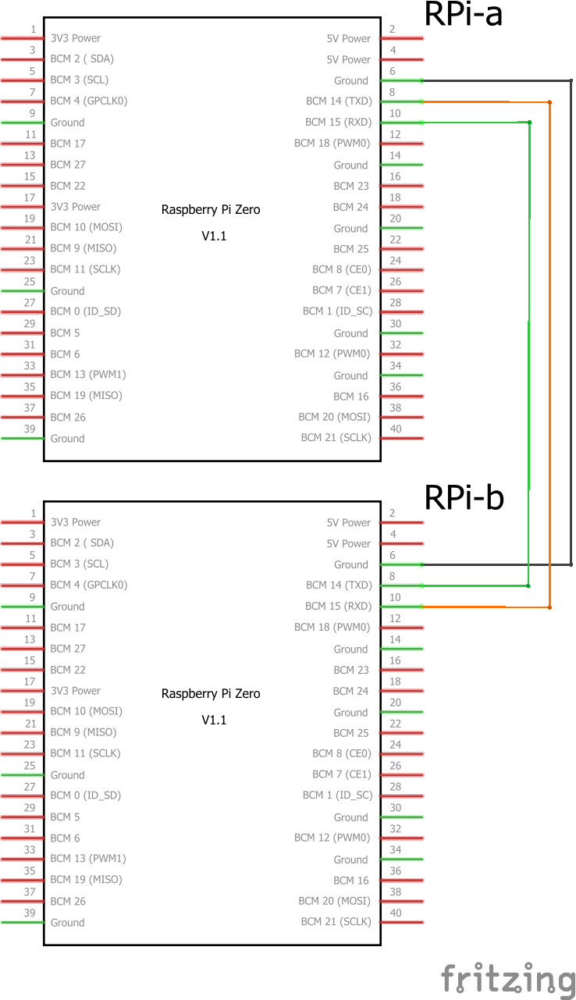

# IP over Serial
Demonstration code / configuration for setting up a raspberry pi internet connection over a serial link to another (internet connected) raspberry pi. Tested on two Raspbery Pi Zero Ws running Rapberian buster. 

This strategy can be used to support IP connection via serial using AX25 or PPP. 

## Preamble
Get things up and running so both devices can be accessed on the command-line from a single laptop.
1. Get each raspbery pi running and configured by connecting a keyboard, mouse, and monitor as needed. Call one `rpi-a` and one `rpi-b`. 
2. Run raspi-config and ensure that ssh, i2c, spi, and hardware serial are on, and that the login shell is not accessible over the serial interface. 
3. Set up each raspberry pi to automatically connect to a convenient WiFi network by editing `/etc/wpa_supplicant/wpa_supplicant.conf` to provide SSID and password - see [wpa_supplicant.conf.append.txt](wpa_supplicant.conf.append.txt) for syntax to append to `/etc/wpa_supplicant/wpa_supplicant.conf`.
```
% sudo nano /etc/wpa_supplicant/wpa_supplicant.conf
```
4. Set the WiFi router to provide consistent predictable IP addresses for each raspberry pi (after initial connection you'll usually be able to see each pi's MAC address). I used 10.0.0.101 and 10.0.0.102. 
5. Reboot the raspbery pis so they get assigned their predictable IP addresses. 
6. Download the [PuTTY](https://www.chiark.greenend.org.uk/~sgtatham/putty/latest.html) ssh client and check you can connect to each pi at their IP address (10.0.0.101 or 10.0.0.102), using the username pi, and the password set in step 1 or 2. 

## Instructions
1. If not already done, run raspi-config and ensure that hardward serial is on, and the login shell is not accessible over the serial interface.
2. RPi-A (10.0.0.101 over WiFi, 192.168.100.101 over serial) will be the bridge to the internet for RPi-B (10.0.0.102 over WiFi, 192.168.100.102 over serial).
3. Connect wires:
   * RPi-A GPIO GND (pin 6) to RPi-B GPIO GND (pin 6)
   * RPi-A GPIO TX (pin 8) to RPi-B GPIO RX (pin 10)
   * RPi-A GPIO RX (pin 10) to RPi-B GPIO TX (pin 8).
   
   <A href="ipoverserial_schem.png"></A>
   
4. On RPi-A, download [bridge_setup.sh](bridge_setup.sh) and execute. This will:
   1. Insert the code [rc.local.insert.sh](rc.local.insert.sh) into `/etc/rc.local` to execute commands for the bridge raspberry pi at at startup. 
   2. Add [axports.append.txt](axports.append.txt) to the end of `/etc/ax25/axports`.
   3. Download [bridge_startup_ax25.sh](bridge_startup_ax25.sh) to `/home/pi` and link it to `/home/pi/.startup.sh` so that the insert of step 4.i will execute it.
   4. Download [bridge_startup_ppp.sh](bridge_startup_ppp.sh) to `/home/pi`. To switch to PPP, link `/home/pi/.startup.sh` to `bridge_startup_ppp.sh`.
   5. The following command will download `bridge_setup.sh` and execute it:
```
wget -q -O - 'https://raw.githubusercontent.com/silver-sat/ipoverradio/master/ipoverserial/bridge_setup.sh' | sh 
```
5. On RPi-B, download the [satellite_setup.sh](satellite_setup.sh) and execute.  This will:
   1. Insert the code [rc.local.insert.sh](rc.local.insert.sh) into `/etc/rc.local` to execute commands for the bridge raspberry pi at at startup. 
   2. Add [axports.append.txt](axports.append.txt) to the end of `/etc/ax25/axports`.
   3. Download [satellite_startup_ax25.sh](satellite_startup_ax25.sh) to `/home/pi` and link it to `/home/pi/.startup.sh` so that the insert of step 5.i will execute it.
   4. Download [satellite_startup_ppp.sh](satellite_startup_ppp.sh) to `/home/pi`. To switch to PPP, link `/home/pi/.startup.sh` to `satellite_startup_ppp.sh`.
   5. The following command will download `satellite_setup.sh` and execute it:
```
wget -q -O - 'https://raw.githubusercontent.com/silver-sat/ipoverradio/master/ipoverserial/satellite_setup.sh' | sh 
```
6. Restart both RPi-A and RPi-B.

## Testing and Diagnositics

1. Connect to RPi-A at 10.0.0.101 and login once it reboots and reconnects to WiFi.
2. The `ifconfig` command should show the serial interface created by `kissattach`
```
rpi-a% ifconfig ax0
ax0: flags=67<UP,BROADCAST,RUNNING>  mtu 484
        inet 192.168.100.101  netmask 255.255.255.0  broadcast 192.168.100.255
        ax25 MYCALL  txqueuelen 10  (AMPR AX.25)
        RX packets 14  bytes 1210 (1.1 KiB)
        RX errors 0  dropped 0  overruns 0  frame 0
        TX packets 14  bytes 1286 (1.2 KiB)
        TX errors 0  dropped 0 overruns 0  carrier 0  collisions 0
```
3. The `route` command should show a route for `192.168.100.XXX` via `ax0`.
```
rpi-a% route -n
Kernel IP routing table
Destination     Gateway         Genmask         Flags Metric Ref    Use Iface
0.0.0.0         10.0.0.1        0.0.0.0         UG    302    0        0 wlan0
10.0.0.0        0.0.0.0         255.255.255.0   U     302    0        0 wlan0
192.168.100.0   0.0.0.0         255.255.255.0   U     0      0        0 ax0
```
4. The `ping` command should indicate an IP connection with RPi-B.
```
rpi-a% ping -n 192.168.100.102
PING 192.168.100.102 (192.168.100.102) 56(84) bytes of data.
From 192.168.100.101 icmp_seq=1 Destination Host Unreachable
From 192.168.100.101 icmp_seq=2 Destination Host Unreachable
From 192.168.100.101 icmp_seq=3 Destination Host Unreachable
From 192.168.100.101 icmp_seq=4 Destination Host Unreachable
From 192.168.100.101 icmp_seq=5 Destination Host Unreachable
From 192.168.100.101 icmp_seq=6 Destination Host Unreachable
64 bytes from 192.168.100.102: icmp_seq=7 ttl=64 time=2250 ms
64 bytes from 192.168.100.102: icmp_seq=8 ttl=64 time=1270 ms
64 bytes from 192.168.100.102: icmp_seq=9 ttl=64 time=286 ms
64 bytes from 192.168.100.102: icmp_seq=10 ttl=64 time=122 ms
64 bytes from 192.168.100.102: icmp_seq=11 ttl=64 time=113 ms
64 bytes from 192.168.100.102: icmp_seq=12 ttl=64 time=113 ms
^C
--- 192.168.100.102 ping statistics ---
12 packets transmitted, 6 received, +6 errors, 50% packet loss, time 361ms
rtt min/avg/max/mdev = 113.401/692.504/2249.590/808.148 ms, pipe 4
```
5. Attempt to ssh to RPi-B at 10.0.0.102 using PuTTY. If the startup script was successful, this will fail. If you are able to connect and login, see what is in the `/home/pi/.startup.log` file. This may indicate what went wrong. Issue the commands in `satellite_startup.sh` manually, with `sudo`, as needed. Use the diagnistics below to determine what isn't working right.
6. Try to connect to RPi-B from RPi-A using the `ssh` command. 
```
rpi-a% ssh 192.168.100.102
Linux raspberrypi-2 4.19.93+ #1290 Fri Jan 10 16:34:37 GMT 2020 armv6l

The programs included with the Debian GNU/Linux system are free software;
the exact distribution terms for each program are described in the
individual files in /usr/share/doc/*/copyright.

Debian GNU/Linux comes with ABSOLUTELY NO WARRANTY, to the extent
permitted by applicable law.
Last login: Thu Feb 13 23:33:13 2020

Wi-Fi is currently blocked by rfkill.
Use raspi-config to set the country before use.

rpi-b% 
```
7. Check `ifconfig`
```
rpi-b% ifconfig ax0
ax0: flags=67<UP,BROADCAST,RUNNING>  mtu 484
        inet 192.168.100.102  netmask 255.255.255.0  broadcast 192.168.100.255
        ax25 MYCALL  txqueuelen 10  (AMPR AX.25)
        RX packets 198  bytes 21502 (20.9 KiB)
        RX errors 0  dropped 0  overruns 0  frame 0
        TX packets 197  bytes 23040 (22.5 KiB)
        TX errors 0  dropped 0 overruns 0  carrier 0  collisions 0
```
7. Check `ifconfig` to see that wifi has no IP address
```
rpi-b% ifconfig wlan0
wlan0: flags=4098<BROADCAST,MULTICAST>  mtu 1500
        ether b8:27:eb:a5:d1:2f  txqueuelen 1000  (Ethernet)
        RX packets 0  bytes 0 (0.0 B)
        RX errors 0  dropped 0  overruns 0  frame 0
        TX packets 0  bytes 0 (0.0 B)
        TX errors 0  dropped 0 overruns 0  carrier 0  collisions 0

```
8. Check `route` - should show a route for `192.168.100.XXX` via `ax0`, and a default route for all IP address via `ax0` and `192.168.100.101` (RPi-A).
```
rpi-b% route -n 
Kernel IP routing table
Destination     Gateway         Genmask         Flags Metric Ref    Use Iface
0.0.0.0         192.168.100.101 0.0.0.0         UG    0      0        0 ax0
192.168.100.0   0.0.0.0         255.255.255.0   U     0      0        0 ax0
```
9. Check wifi status
```
rpi-b% rfkill
ID TYPE      DEVICE      SOFT      HARD
 0 wlan      phy0     blocked unblocked
 1 bluetooth hci0   unblocked unblocked
```
10. Ping RPi-A.
```
rpi-b% ping -n 192.168.100.101
PING 192.168.100.101 (192.168.100.101) 56(84) bytes of data.
64 bytes from 192.168.100.101: icmp_seq=1 ttl=64 time=300 ms
64 bytes from 192.168.100.101: icmp_seq=2 ttl=64 time=113 ms
64 bytes from 192.168.100.101: icmp_seq=3 ttl=64 time=113 ms
64 bytes from 192.168.100.101: icmp_seq=4 ttl=64 time=113 ms
64 bytes from 192.168.100.101: icmp_seq=5 ttl=64 time=113 ms
^C
--- 192.168.100.101 ping statistics ---
5 packets transmitted, 5 received, 0% packet loss, time 6ms
rtt min/avg/max/mdev = 113.333/150.668/299.862/74.597 ms

```
11. Check time-servers via NTP
```
rpi-b% ntpq -p
     remote                                   refid      st t when poll reach   delay   offset   jitter
=======================================================================================================
 0.debian.pool.ntp.org                   .POOL.          16 p    -  256    0   0.0000   0.0000   0.0038
 1.debian.pool.ntp.org                   .POOL.          16 p    -  256    0   0.0000   0.0000   0.0038
 2.debian.pool.ntp.org                   .POOL.          16 p    -  256    0   0.0000   0.0000   0.0038
 3.debian.pool.ntp.org                   .POOL.          16 p    -  256    0   0.0000   0.0000   0.0038
+pacific.latt.net                        44.24.199.34     3 u   15   64    7 187.7583   0.0220  42.3096
#nu.binary.net                           128.252.19.1     2 u   15   64    7 217.3441  16.9085  37.6448
 4-53-160-75.rev.nuso.cloud              .STEP.          16 u    -   64    0   0.0000   0.0000   0.0038
+christensenplace.us                     209.51.161.238   2 u   15   64    7 130.6786   1.1954  40.1299
#toddadev.your.org                       .GPS.            1 u    5   64   17 167.0352  -7.4165   7.5310
+ntp.xtom.com                            216.218.254.202  2 u    8   64   17 185.8063  -1.4472  31.6412
+time.cloudflare.com                     10.16.12.8       3 u    7   64   17 120.5437  -0.5261  22.8517
+chl.la                                  216.218.192.202  2 u   10   64   17 196.4088   3.8610  25.6559
+208.67.72.43                            128.227.205.3    2 u    2   64   17 159.6932  -2.7748  84.4776
+time.cloudflare.com                     10.16.12.8       3 u   37   64   17 122.6732   0.6298  57.9533
#vf1.bbnx.net                            253.109.221.150  2 u   52   64   17 175.6266  -8.6933  21.2382
+vf2.bbnx.net                            252.74.143.178   2 u  116   64   16 172.7354  -2.5115  15.0842
 ntp5.linocomm.net                       .STEP.          16 u    -   64    0   0.0000   0.0000   0.0038
 atl0.ntp3.mattnordhoff.net              .STEP.          16 u    -   64    0   0.0000   0.0000   0.0038
 jikan.ae7.st                            .STEP.          16 u    -   64    0   0.0000   0.0000   0.0038
 t1.time.gq1.yahoo.com                   .STEP.          16 u    -   64    0   0.0000   0.0000   0.0038
+mailhost.netads.com                     209.51.161.238   2 u   29   64   17 131.1492   0.3369   4.8790
+ntp1.doctor.com                         50.205.244.27    2 u    4   64   17 133.9559 -10.6462   6.6150
*hydrogen.constant.com                   209.51.161.238   2 u   28   64   17 129.5085   1.0284  16.0165
```
12. Full internet connection test
```
rpi-b% wget -O /dev/null http://ipv4.download.thinkbroadband.com/10MB.zip
```
