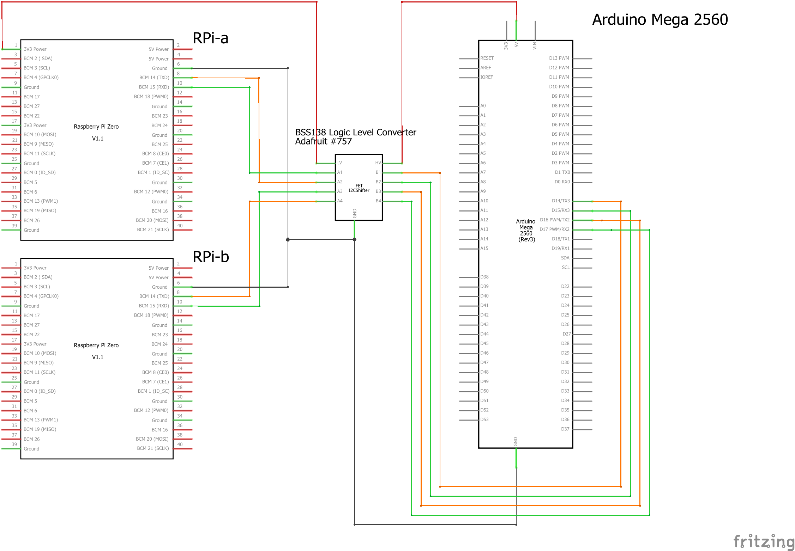

# IP via Arduino

Demonstration code / configuration for setting up a raspberry pi internet connection over a serial link to an arduino which acts as a serial relay connected to another (internet connected) raspberry pi. Tested on two Raspbery Pi Zero Ws running Rapberian buster, and an Arduino MEGA 2560. Note that the Arduino Uno has no (unoccupied) hardware serial pins, and so called soft serial cannot listen on more than one interface at a time. 

## Preamble
See instructions for [IP over Serial](../ipoverserial/README.md) for the RPi configuration needed. This is not changed for IP via Arduino. Note that this infrastructure can support AX25 or PPP based connection over serial. 

## Instructions
1. Install [4-channel BSS138 I2C-safe Bi-directional Logic Level Converter](https://www.adafruit.com/product/757) (LLC) in breadboard. 
1. Connect wires:
   * RPi-A GPIO GND (pin 6) to LLC LOW-SIDE GND 
   * RPi-A GPIO RX (pin 10) to LLC A1
   * RPi-A GPIO TX (pin 8) to LLC A2
   * RPi-B GPIO GND (pin 6) to LLC LOW-SIDE GND 
   * RPi-B GPIO RX (pin 10) to LLC A3
   * RPi-B GPIO TX (pin 8) to LLC A4
   * RPi-B GPIO 3.3V (pin 1) to LLC LV
   * MEGA GND to LLC HIGH-SIDE GND
   * MEGA 3.3V to LLC HV
   * MEGA TX3 (pin 14) to LLC B1
   * MEGA RX3 (pin 15) to LLC B2
   * MEGA TX2 (pin 16) to LLC B3
   * MEGA RX2 (pin 17) to LLC B4
   
   
   
1. Push the file [SerialPassthrough.ino](SerialPassthrough.ino) to the Arduino Mega
1. Reboot the raspberry pis. 
   
   
