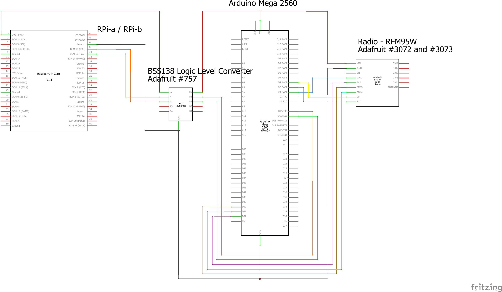

# IP via Radio

Demonstration code / configuration for setting up a raspberry pi to respberry pi IP connection via radio connected arduinos. Tested on two Raspbery Pi Zero Ws running Rapberian buster, two Arduino MEGA 2560s, each using a RFM95W radio chip via SPI.

## Notes
1. Arduino Uno software serial port does not seem up to the task of managing the serial communication with the RPis.
1. The following setup will work for AX25 or PPP based IP connection (and the observations below seem to apply to both). 
1. The arduino code is currently protocol-details-free (for better or worse). 
1. The RPi sends serial data in what appears to be a single burst that is (substantially) bigger than the expected MTU data-packet size, and these large bursts do not appear to contain multiple packets.
1. The RFM95W chip can send at most 256 bytes per message and is only half duplex.
1. The 484 MTU size for the RNode documentaiton for AX25 is intended to ensure that each packet requires at most two messages. 
1. The RadioHead library suggested by AdaFruit for the RFM95W chip on Arduino does not make any attempt to solve the message size problem, in the arduino code shows one (imperfect) attempt to send each (large) message as multiple short messages. 
1. The connection works OK as long as the messages are one-way or the other, but when multiple simultaneous messages back and forth are sent, packtes get dropped. It is unclear whether these are droped in the serial connection, the radio connection etc. 10=20% of packets are marked as RX error. 
1. Pings are easy as they are single direction and can be constrained in size. Big pings can be mostly reliable, even when multi-messages are needed.
1. The connection will support a (very slow) SSH login from RPi-a to RPi-b, which suggests bi-directional communication is working. Diagnostic logs suggest that most of these IP packets are small and the packets are request and response, and seems to work OK. The connection seems to transmit about 100-200 bytes / sec in this mode. 
1. The connection will not support a HTTP request download very well (at least using wget/curl) even for modest files (10K). 
1. PPP is very "chatty" with lots of background messages unrelated to the IP traffic going back and forth while the connection is active - these cause problems - turning off compression helps because this reduces the number of the compression negotiation messages PPP is sending. Having the PPP connection drop and have to reinstate itself is not uncommon. 
1. AX25 is almost completely stateless. It appears to essentially believe it is always up, with each new use of the connection a potential for success or failure. There is very little "additional" traffic over the connection other than the IP packets themselves. Howerver, it seems to be quite a bit slower. 

## Preamble
See instructions for [IP over Serial](../ipoverserial/README.md) for the RPi configuration needed. This is not changed for IP via Radio. Note that this infrastructure can support AX25 or PPP based connection.

## Instructions (for each side of the radio link)
1. Install [4-channel BSS138 I2C-safe Bi-directional Logic Level Converter](https://www.adafruit.com/product/757) (LLC) in breadboard. 
1. Install [RFM96W LoRa Radio Transceiver Breakout - 433 MHz](https://www.adafruit.com/product/3073) (RFM96W) in breadboard. 
1. Connect wires:
   * RPi-a GPIO GND (pin 6) to LLC LOW-SIDE GND 
   * RPi-a GPIO RX (pin 10) to LLC A1
   * RPi-a GPIO TX (pin 8) to LLC A2
   * RPi-a GPIO 3.3V (pin 1) to LLC LV
   * MEGA GND to LLC HIGH-SIDE GND
   * MEGA TX3 (pin 14) to LLC B1
   * MEGA RX3 (pin 15) to LLC B2
   * MEGA 5V to LLC HV
   * MEGA GND to RFM95W GND
   * MEGA PIN 2 to RFM95W RST
   * MEGA PIN 3 to RFM95W DIO0/G0
   * MEGA PIN 4 to RFM95W CS
   * MEGA PIN 50 to RFM95W MISO
   * MEGA PIN 51 to RFM95W MOSI
   * MEGE PIN 52 to RFM95W SCK
   * MEGA 5V to RFM95W VIN
  
   
   
1. Push the file [RadioPassthrough2.ino](RadioPassthrough1.ino) to the Arduino Mega
1. Reboot the raspberry pis. 
   
   
